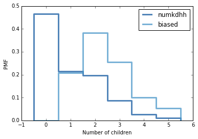

[Think Stats Chapter 3 Exercise 1](http://greenteapress.com/thinkstats2/html/thinkstats2004.html#toc31) (actual vs. biased)


Outline:

This problem presents a robust example of actual vs biased data. As a data scientist, it will be important to examine not only the data that is available, but also the data that may be missing but highly relevant. You will see how the absence of this relevant data will bias a dataset, its distribution, and ultimately, its statistical interpretation.


Problem:

Something like the class size paradox appears if you survey children and ask how many children are in their family. Families with many children are more likely to appear in your sample, and families with no children have no chance to be in the sample.

Use the NSFG respondent variable numkdhh to construct the actual distribution for the number of children under 18 in the respondents' households.

Now compute the biased distribution we would see if we surveyed the children and asked them how many children under 18 (including themselves) are in their household.

Plot the actual and biased distributions, and compute their means.

Solution:

The problem asks us to identify the bias in the responses from children, because only families with 1 or more children would have responsed in this group of children surveyed, biasing the data.


```python
import thinkstats2
import thinkplot

resp = nsfg.ReadFemResp()

pmf = thinkstats2.Pmf(resp.numkdhh, label='numkdhh')

thinkplot.Pmf(pmf)
thinkplot.Config(xlabel='Number of children', ylabel='PMF')

biased = BiasPmf(pmf, label='biased')

thinkplot.PrePlot(2)
thinkplot.Pmfs([pmf, biased])
thinkplot.Config(xlabel='Number of children', ylabel='PMF')

pmf.Mean()
```
Comes out to 1.0242051550438309

```python
biased.Mean()
```
Comes out to 2.4036791006642821



Results/meaning:

The average number of children in families is higher according to children because only families with children will be reported by children. Families reporting no children are only included in the survey conducted with adults outside of school.