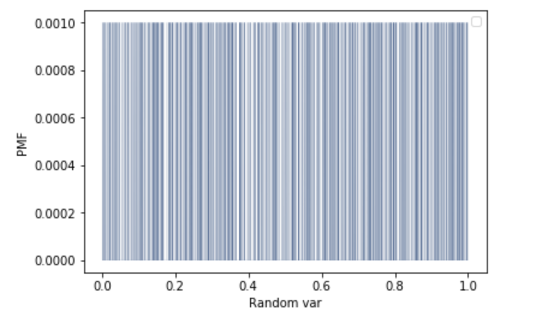
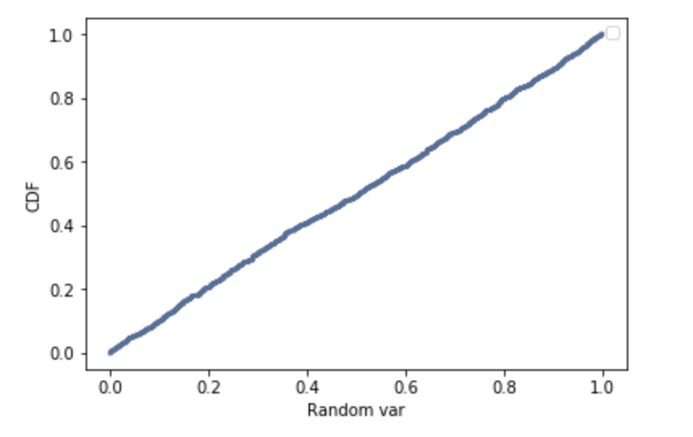

[Think Stats Chapter 4 Exercise 2](http://greenteapress.com/thinkstats2/html/thinkstats2005.html#toc41) (a random distribution)

>> Outline:

This questions asks you to examine the function that produces random numbers. Is it really random? A good way to test that is to examine the pmf and cdf of the list of random numbers and visualize the distribution. If you're not sure what pmf is, read more about it in Chapter 3.


>>> Problem:

The numbers generated by random.random are supposed to be uniform between 0 and 1; that is, every value in the range should have the same probability.

Generate 1000 numbers from random.random and plot their PMF and CDF. Is the distribution uniform?


>>> Solution:

```python
import thinkstats2
import thinkplot
import numpy as np
%matplotlib inline

t = np.random.random(1000)
```

First examine the PMF:

```python
pmf = thinkstats2.Pmf(t)
thinkplot.Pmf(pmf, linewidth=0.1)
thinkplot.Config(xlabel='Random var', ylabel='PMF')
```



Examine the CDF:

```python
cdf = thinkstats2.Cdf(t)
thinkplot.Cdf(cdf)
thinkplot.Config(xlabel='Random var', ylabel='CDF')
```



Is the distribution uniform?


>>> Results/meaning:

The distribution of random numbers is incredibly uniform, more than the examples provided even. The CMF approximates a straight line, indicating even distribution of values through our sample data.